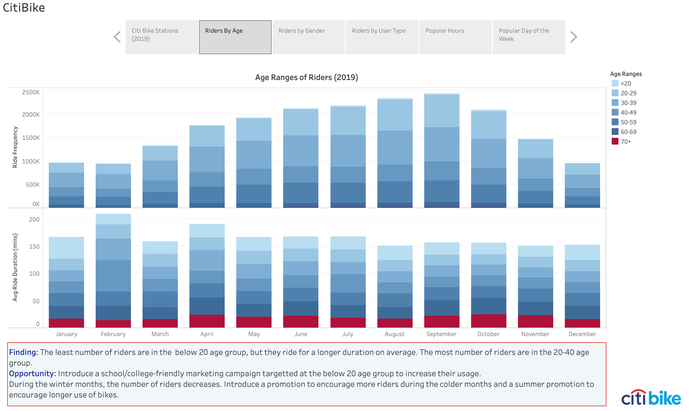
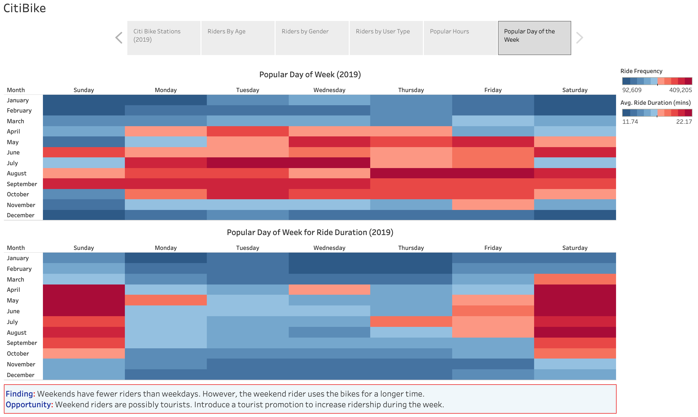

# tableau-challenge

>  Build a tableau visualization to identify unexpected phenomena in CitiBike usage.

## Table of contents
* [Tableau Visualization](#Tableau-Visualization)
* [Data Sources](#data-sources)
* [Analysis](#Analysis)
* [Technologies](#technologies)
* [Contact](#Contact)

## General Information
The following visualization looks at the CitiBike Trip History logs for 2019 in New York City. 

The visuals look at:
- The usage of bikes across all the stations of New York City to find out the most popular stations where most bikes have been rented as well as the stations where bikes are rented for the longest duration.
- The age ranges of riders to identify which age groups rent the most number of bikes as well as the age group that rent bikes for the longest time.
- The difference, if any, in the number of bikes rented by male vs female riders. As well as the gender that rents bikes for the longest time.
- The most popular hours of the day to rent bikes as well as the times when bikes are rented for the longest time.
- The most popular days of the week to rent bikes as well as the days when bikes are rented for the longest time.

Notes: 
- Ages up to 100 only were considered in the dataset.
- Only Male and Female was included in gender.

## Tableau Visualization
[Citi Bike Analysis](https://public.tableau.com/views/CitiBike_16130842989820/CitiBike?:language=en&:display_count=y&publish=yes&:origin=viz_share_link)

Please use full screen mode for optimal viewing.

## Data Sources
[Citi Bike Data](https://www.citibikenyc.com/system-data)
Collated Citibike usage data for 2019

## Analysis

### Top Stations
**Finding:** The majority of the top bike stations are in the central Manhattan area.  The 2 most popular stations are 'Pershing Square North' and '8 Ave & W 31 ST'. It is notable that they are situated close to major train stations: Grand Central Terminal and Penn Station respectively. 
The majority of long duration rides originate from the Brooklyn borough.

### Age Range of Riders
**Finding:** The least number of riders are in the  below 20 age group, but they ride for a longer duration on average. The most number of riders are in the 20-40 age group.   
**Opportunity:** Introduce a school/college-friendly marketing campaign targetted at the below 20 age group to increase their usage.
During the winter months, the number of riders decreases. Introduce a promotion to encourage more riders during the colder months and a summer promotion to encourage longer use of bikes.

### Riders By Gender
**Finding:** There are more male riders than female riders, though males and females ride for almost the same time across the age groups.   
**Opportunity:** Introduce a marketing strategy to increase adoption by female riders.

### Riders By User Type
**Finding:** Throughout the year more subscribers use bikes than customers. However, customers use bikes for a longer period of time.   
The largest group of subscribers are in the 30-39 age group. The largest group of customers are in the 50-59 age group.
**Opportunity:** Target customers to increase bike usage and subscribers to use bikes for longer.

### Popular Hours of the Day
**Finding:** More people use bikes during peak office hours. However, bikes are used for a longer period in the early hours of the day.   
**Opportunity:** Introduce a promotion for off-peak hours to increase the number of riders.

### Popular Day of the Week
**Finding:** Weekends have less riders than weekdays. However, the weekend rider uses the bikes for a longer time.   
**Opportunity:** Weekend riders are possibly tourists. Introduce a tourist promotion to increase ridership during the week.

## Technologies
* Python
* Pandas
* Tableau

## Contact
Created by [@deepavadakan](https://github.com/)